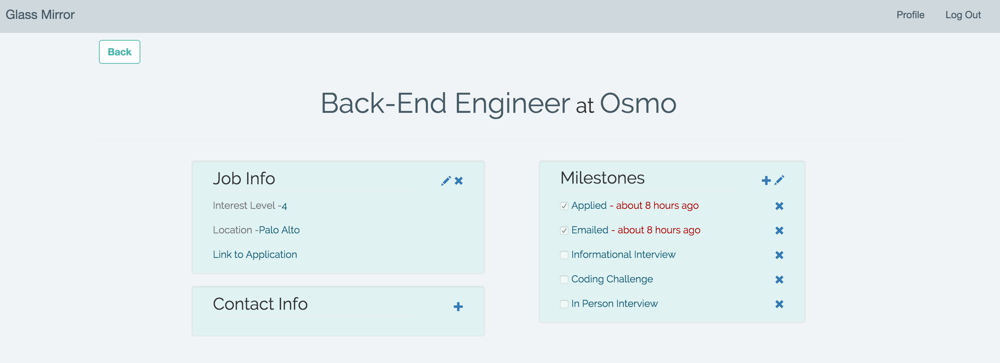
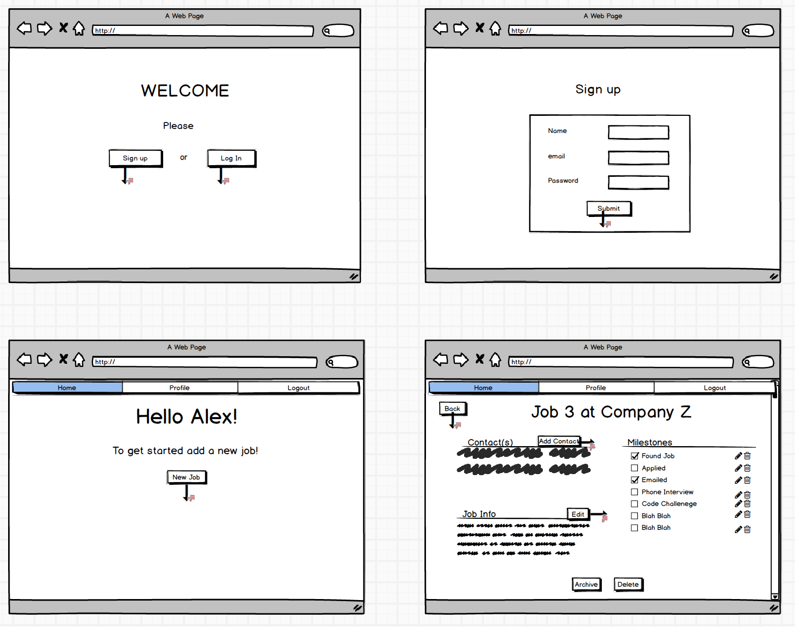
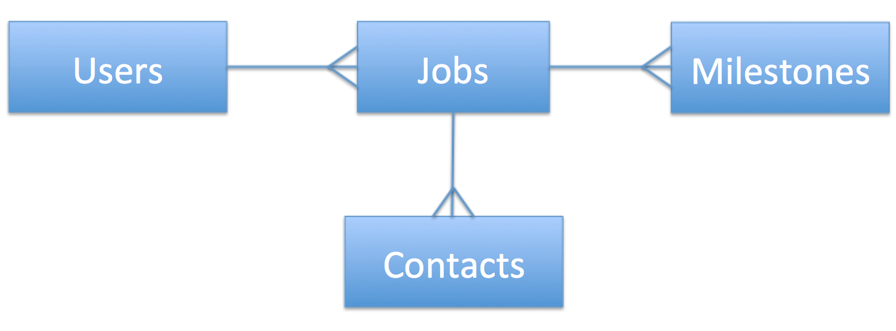

# Glass Mirror

Glass Mirror is a web application built to help a user organize their job search information. It allows a user to store job and contact information, and also has a system to track milestones for each job. \
Here is the link to the website on [Heroku](https://glass-mirror.herokuapp.com/).

# Contents
* [Getting Started](#getting-started)
* [Screenshot](#screenshot)
* [Wireframes](#wireframes)
* [Models](#models)
* [Technologies](#technologies)
* [Future Features](#future-features)

# Getting Started
1. Fork this repo and clone it onto your local machine.
2. Switch to the glass_mirror directory
3. Run `bundle install` to install gems.
4. Run `rake db:setup` to create and migrate the database (PostgreSQL must be installed on your machine).
5. Run `rails s` to start the server locally.
6. Go to localhost:3000 in your browers and create an account to get started.

# Screenshot

# Wireframes

# Models

# Technologies
* Languages
	* Ruby on Rails
	* HTML5
	* CSS3
* Gems/External Libraries
	* bcrypt
	* Bootstrap
* Database
	*  PostgreSQL

# Future Features
* A notifcation system to alert a user a certain amount of time after they checked off a milestone.
* A sorting system, to sort the list of jobs on the user show page.
* A way to search through all of a user's contacts.
* A type of point/reward system that entices a user to apply to more jobs.
* A simpler more user friendly design.
* Job suggestions based off of what other users in the same industry are applying to.
